TP 2 - Machine Learning

Exercice 1 : 

Question 1.a : 

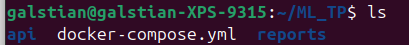

Question 1.b : 

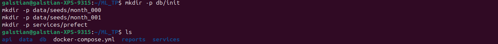

Question 1.c : 

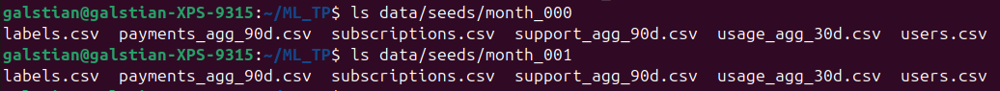

Exercice 2 : 

Question 2.a : 

Le schéma a bien été créé :

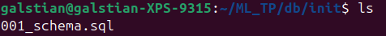

Question 2.b :

Le fichier .env contient des variables d’environnement qui seront automatiquement injectées dans les conteneurs Docker. Cela permet de séparer la configuration (mots de passe, noms de base, etc.) du code.

Question 2.c :

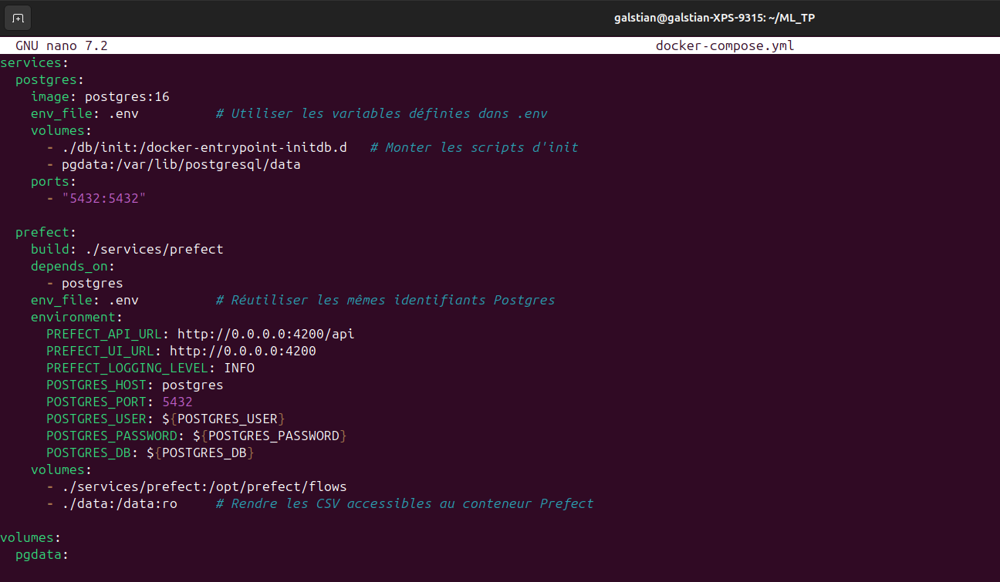

Question 2.d :

Lors du démarrage du service PostgreSQL, le port 5432 était déjà utilisé sur la machine hôte.
J’ai modifié le mapping de ports dans docker-compose.yml pour exposer PostgreSQL sur le port 5434, ce qui a permis de démarrer le conteneur correctement :

Concernant les tables :

La table users contient les informations démographiques et de base sur chaque utilisateur (date d’inscription, âge, situation familiale, etc.).

La table subscriptions stocke les informations liées aux abonnements des utilisateurs (type de contrat, options, coûts, durée).

La table usage_agg_30d regroupe des statistiques d’usage agrégées sur les 30 derniers jours (temps de visionnage, sessions, appareils).

La table payments_agg_90d contient des indicateurs liés aux paiements sur les 90 derniers jours, notamment les échecs de paiement.

La table support_agg_90d regroupe les interactions avec le support client sur les 90 derniers jours (tickets ouverts, temps de résolution).

Finalement, la table labels contient la variable cible du problème de Machine Learning, indiquant si l’utilisateur a churn ou non.

Exercice 3 :

Question 3.a : 

Le conteneur Prefect est responsable de l’orchestration du pipeline d’ingestion, c’est-à-dire l’exécution et le suivi des différentes tâches de chargement des données dans la base PostgreSQL.

Question 3.b : 

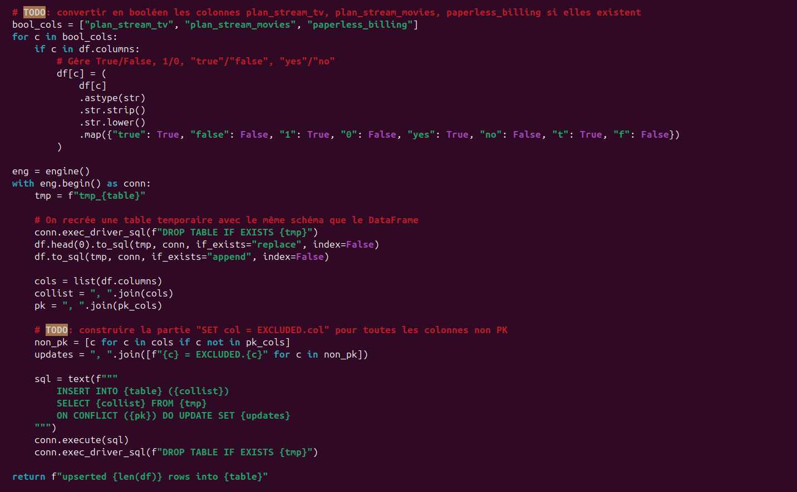

La fonction upsert_csv lit un fichier CSV et insère ses données dans une table PostgreSQL en utilisant une stratégie d’upsert.
Elle charge d’abord les données dans une table temporaire, puis effectue un INSERT ... ON CONFLICT DO UPDATE afin de mettre à jour les lignes existantes ou d’insérer les nouvelles.
Cette approche garantit une ingestion en évitant les doublons et permettant de rejouer le pipeline sans corrompre les données.

Question 3.c : 

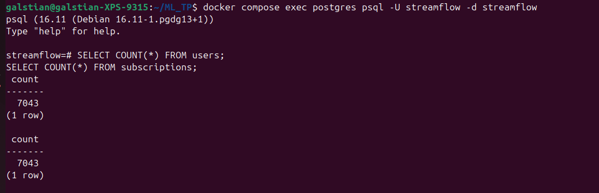

On a 7043 clients après l’ingestion de month_000 (le nombre de lignes dans users correspond au nombre de clients uniques).

Exercice 4 : 

Question 4.a : 

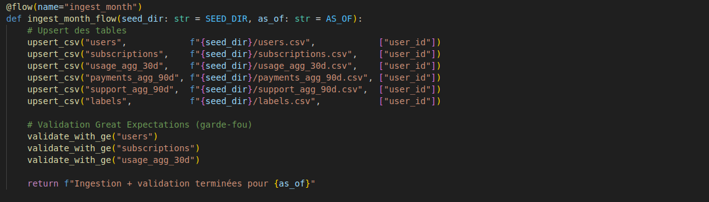

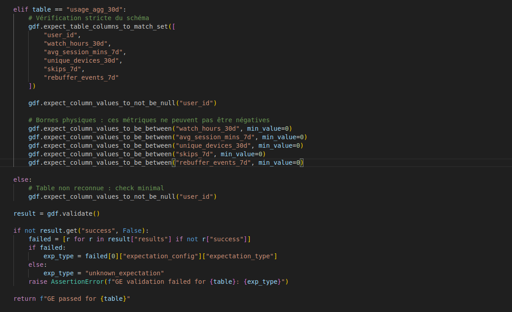

La fonction validate_with_ge applique des règles de qualité de données après ingestion. Elle vérifie que les tables respectent le schéma attendu et que certaines valeurs numériques restent dans des bornes physiquement plausibles. En cas de données incohérentes ou corrompues, le flow échoue immédiatement, évitant ainsi d’alimenter les étapes aval (features, modèles) avec des données invalides.

Question 4.b : 

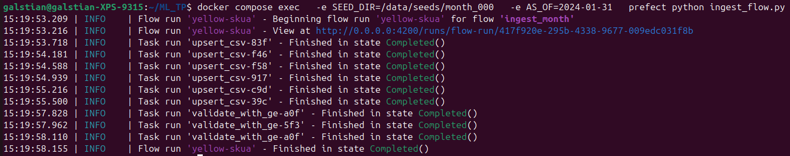

Question 4.c : 

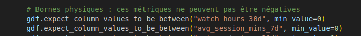

Ces bornes ont été choisies car des variables de consommation comme les heures de visionnage, durée moyenne de session, ou le volume téléchargé ne peuvent pas être négatifs donc une valeur négative indiquerait clairement un bug de calcul, un export corrompu, ou une mauvaise conversion de type.

Cela protège le modèle car les règles empêchent d’entraîner/servir un modèle sur des données “impossibles”. Elles permettent d'éviter des distributions incohérentes, et permettent de détecter très tôt des anomalies qui dégraderaient fortement les features et donc la performance du modèle.

Exercice 5 : 

Question 5.a : 

Mise à jour du flow : 

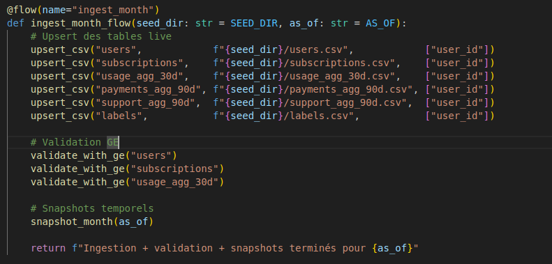

Bloc d'insertion dans payments_agg_90d_snapshots complété : 

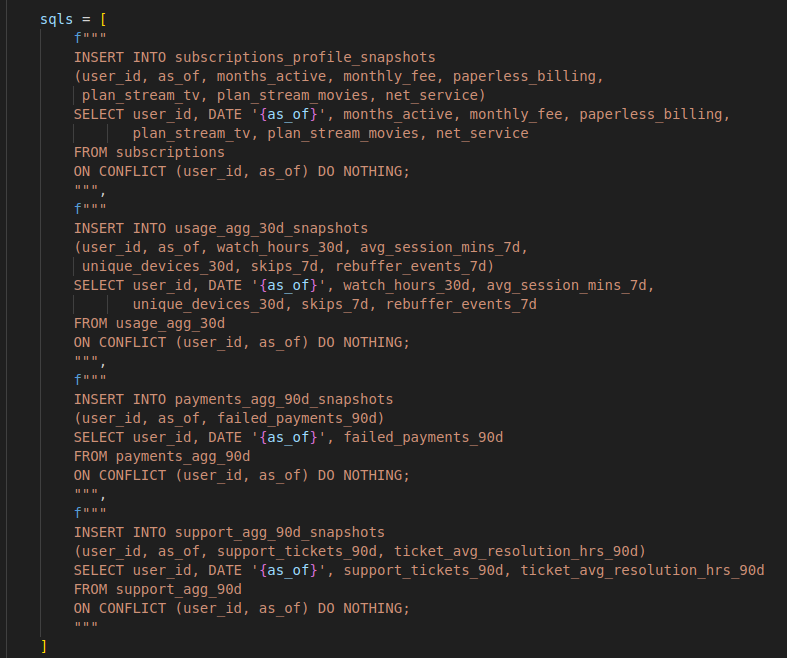

La fonction snapshot_month fige l’état des tables live à une date donnée as_of en copiant les données dans des tables de snapshots temporels, ce qui permet de conserver un historique des données mois par mois.

Question 5.b : 

Lancement de l'ingestion pour le mois month_001 : 

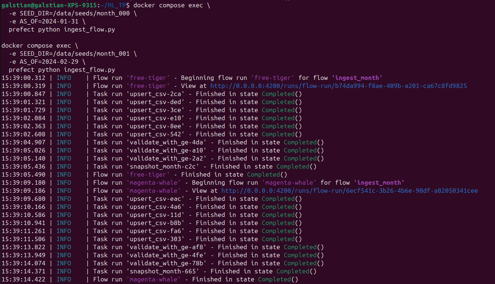

Vérification de l'existence des snapshots pour les deux dates : 

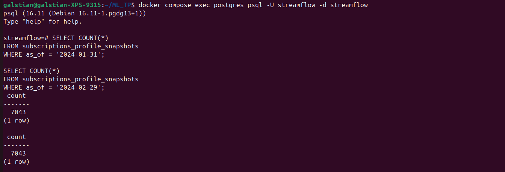

Le nombre de lignes peut augmenter entre deux snapshots car de nouveaux clients peuvent apparaître entre deux mois, chaque snapshot représentant l’état exact de la base à la date as_of. Mais ici, j'ai le même nombre de lignes dans la table de snapshots pour ces deux dates ce qui veut dire que le nombre de clients n'a pas évolué (ou le nombre de résiliation des abonnements s'est compensé avec le nombre de nouvelles arrivées je crois).

Question 5.c : 

CSV (month_XXX)
      |
      v
  Upsert tables live
      |
      v
Validation Great Expectations
      |
      v
Snapshots temporels (as_of)
      |
      v
Tables *_snapshots

- On ne travaille pas directement sur les tables live pour entrainer un modèle car elles évoluent en permanence et contiennent des informations futures par rapport à une date d’observation donnée. Entraîner un modèle directement dessus introduirait une fuite de données temporelle, faussant les performances et invalidant toute évaluation.

- Les snapshots permettent d’éviter la data leakage et de garantir la reproductibilité temporelle en figeant l’état exact des données à une date donnée (as_of) : le modèle est ainsi entraîné uniquement sur des informations qui étaient effectivement disponibles à ce moment-là, sans inclure des mises à jour futures des tables live, ce qui empêche l’utilisation involontaire de données « du futur » et permet de réentraîner ou d’auditer le modèle ultérieurement sur exactement le même jeu de données.

- La partie la plus complexe de ce TP a été la gestion des schémas et des types de données entre les CSV, PostgreSQL et les validations Great Expectations. Plusieurs erreurs de colonnes manquantes ou de types incorrects ont nécessité une inspection fine du schéma SQL. Ces difficultés m’ont permis de mieux comprendre l’importance des contrôles qualité automatisés et de la rigueur dans la conception des pipelines de données.
