TP 4 - Machine Learning

Exercice 1 :

Question 1 : 

Démarrage du stack Docker Compose et vérification du démarrage des conteneurs : 

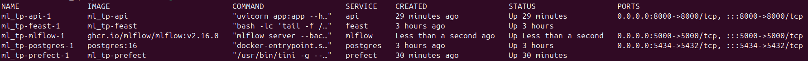

Ajout du service MLflow dans docker-compose.yml

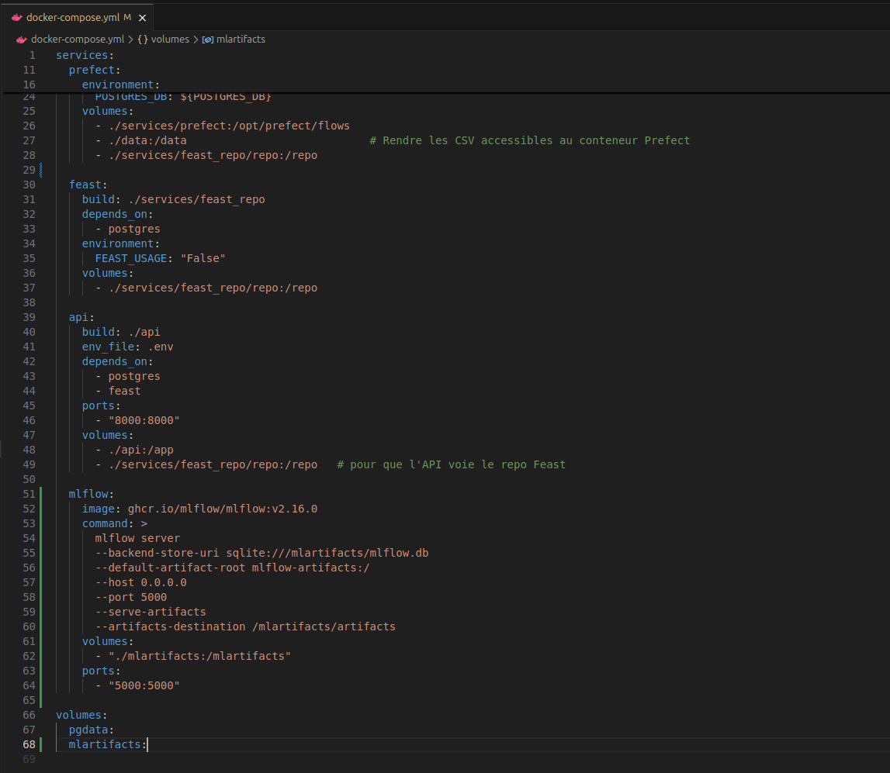

Vérification de l'accessibilité des endpoints MLflow UI et API /health :

Smoke check : 

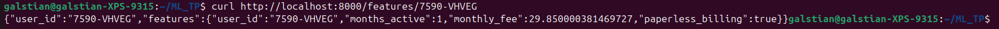

Les commandes utilisées sont visibles dans les screens mais voici la liste : 

- docker compose up -d --build
- docker compose ps
- curl http://localhost:8000/health
- curl http://localhost:8000/features/7590-VHVEG

Les différents composants qui tournent et pourquoi : 

Le service PostgreSQL joue un rôle central : il stocke les données brutes et agrégées, les tables de snapshots mensuels, ainsi que les données utilisées par Feast comme offline et online store.

Le service Prefect est utilisé pour orchestrer les différentes étapes du pipeline de données. Il permet de lancer l’ingestion, la validation, la création des snapshots et la génération du dataset d’entraînement de manière reproductible et contrôlée.

Le service Feast correspond au Feature Store. Il contient la définition des entités, des sources de données et des FeatureViews. Il permet à la fois de récupérer des features en mode offline pour l’entraînement et en mode online pour le serving.

Le service API (FastAPI) expose des endpoints accessibles depuis l’extérieur. À ce stade, il permet de vérifier l’état du service via /health et de récupérer les features d’un utilisateur via /features/{user_id}. Il sera étendu par la suite pour fournir des prédictions.

Enfin, le service MLflow est utilisé pour le suivi des expérimentations et la gestion des modèles. Il permet de tracer les entraînements (paramètres, métriques, artefacts) et de gérer le Model Registry afin de promouvoir une version de modèle en Production.

Question 2 :

L'execution de train_baseline.py dans le conteneur prefect sur month_000 se termine bien avec un message [OK] et un run_id :

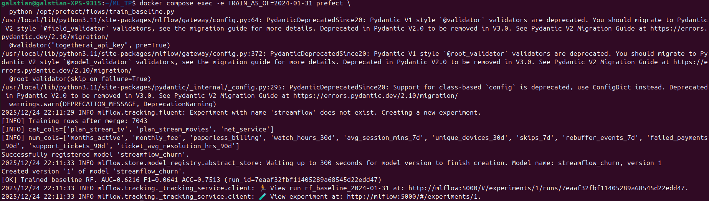

- AS_OF utilisé : 2024-01-31

- Nombre de lignes du dataset après merge : 7043

- Colonnes catégorielles détectées (cat_cols) :

plan_stream_tv
plan_stream_movies
net_service

- Métriques (validation) :

AUC : 0.6216
F1 : 0.0641
Accuracy : 0.7513

- Temps d’entraînement : 0,55 seconde, ce qui est cohérent avec la taille du jeu de données et la complexité modérée du modèle.

Fixer AS_OF permet de figer le contexte temporel des données utilisées pour l’entraînement : on sait exactement à quelle date les snapshots et les labels correspondent. Cela évite de mélanger des informations futures dans les features (data leakage) et garantit que le dataset est reproductible si on relance l’entraînement plus tard.

Fixer un random_state rend déterministes les étapes aléatoires (split train/val, construction des arbres du RandomForest, etc.). Sans seed, deux exécutions sur le même dataset peuvent produire des métriques différentes, ce qui rend la comparaison de runs MLflow moins fiable.

Question 3 :

L'expérience associée à mon entraînement est : 

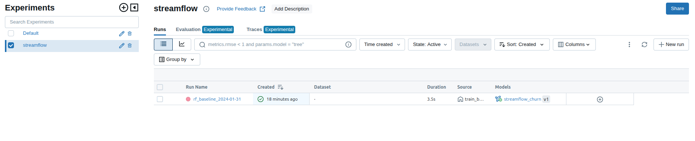

Modèle streamflow_churn enregistré par mon script dans les registered models : 

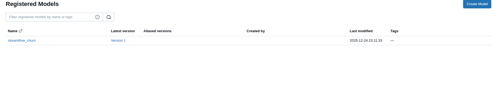

Capture de l’UI MLflow montrant le run (métriques + artefacts) :

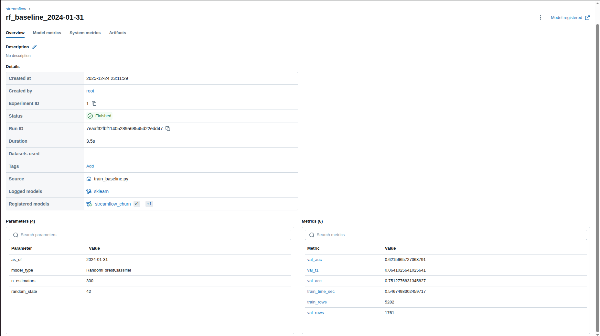

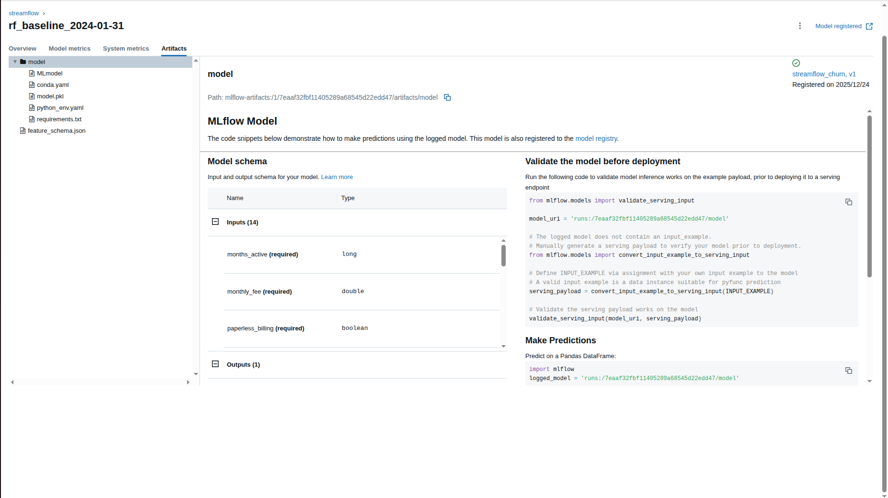

Capture du Model Registry avec le modèle en Production :

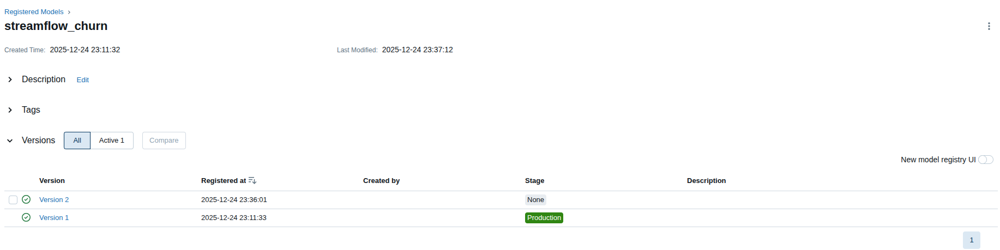

Numéro de version promu : Version 1 comme on voit sur le screen précédent

La promotion d’un modèle via le Model Registry de MLflow permet de gérer proprement le cycle de vie des modèles grâce aux stages (None, Staging, Production).
Contrairement à un déploiement manuel par fichiers, cette approche garantit que la version du modèle utilisée est clairement identifiée et contrôlée.

Les stages permettent de distinguer un modèle en test d’un modèle réellement utilisé en production, ce qui réduit les erreurs humaines et facilite les retours en arrière si nécessaire.
Enfin, le Model Registry améliore la traçabilité, la reproductibilité et la sécurité du déploiement, tout en évitant de modifier le code pour changer de modèle.

Question 4 :

app.py mis à jour : 

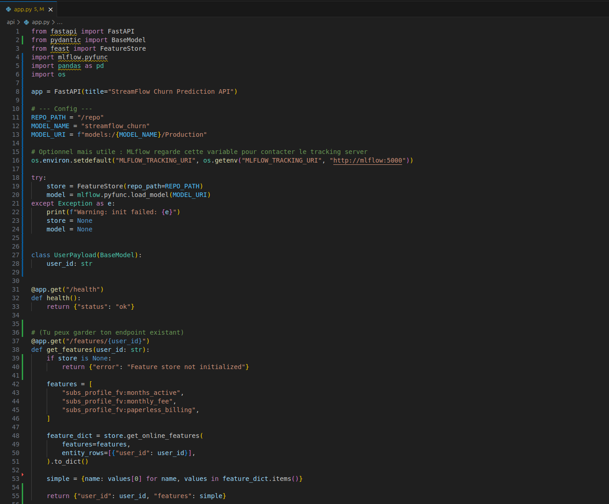

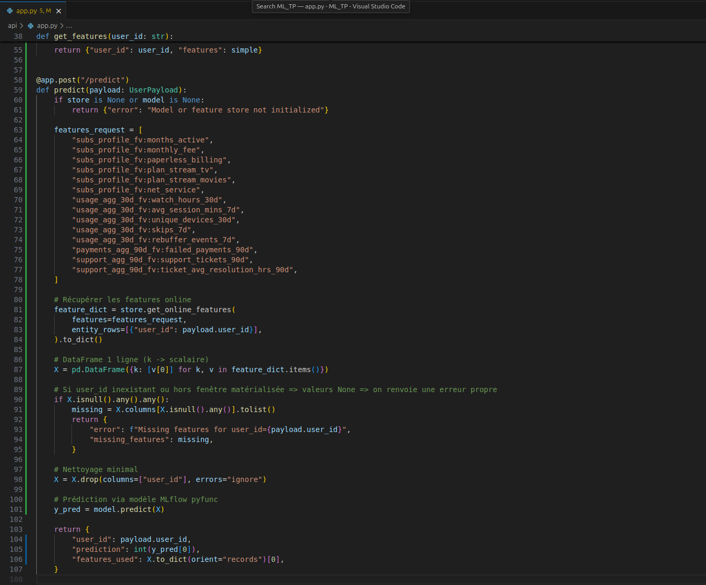

Requête réussie (capture Swagger ou commande curl) et réponse JSON obtenue : 

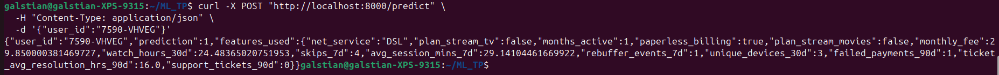

Le modèle chargé par l'API doit pointer vers models:/streamflow_churn/Production et pas vers un fichier local (.pkl) ou un artifact de run car models:/streamflow_churn/Production pointe vers la version officiellement promue dans le Model Registry : l’API charge donc exactement le même modèle que celui validé et déployé. 

Un fichier local .pkl ou un artifact de run dépend d’un chemin et d’une version “au hasard”, ce qui casse la traçabilité, complique les rollbacks et rend le déploiement non reproductible. Avec le stage Production, on centralise la gouvernance : promotion contrôlée, historique des versions, et changement de modèle sans modifier le code de l’API (il suffit de promouvoir une nouvelle version).

Exercice 5 :

Test OK et test KO : 

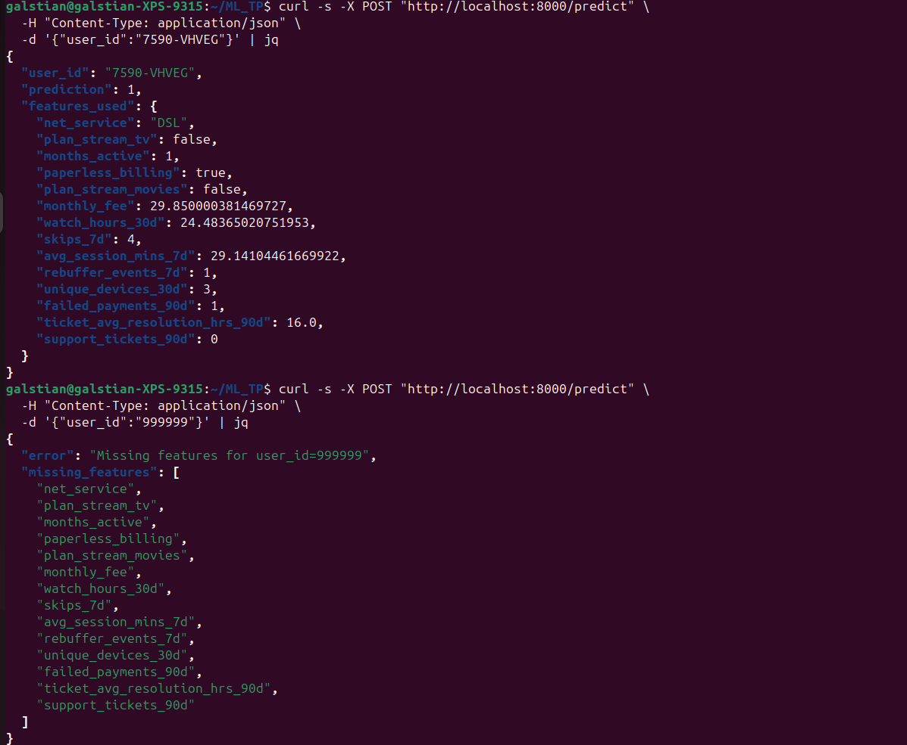

Requête réussie : quand user_id existe dans l’online store et que la matérialisation Feast contient toutes les colonnes, l’API construit un DataFrame (1 ligne) puis appelle le modèle MLflow en Production pour renvoyer une prédiction.

Requête échouée : si l’entité est absente (user_id inconnu) ou si l’online store est incomplet / pas à jour, Feast renvoie des None pour certaines features. L’API détecte ces valeurs manquantes et renvoie une erreur avec la liste missing_features, ce qui évite de prédire sur des données invalides.

Exercice 6 : 

MLflow garantit la traçabilité complète des entraînements en enregistrant pour chaque run les paramètres utilisés (AS_OF, hyperparamètres), les métriques obtenues (AUC, F1, accuracy), les artefacts (schéma des features, modèle) et le code exécuté.
Il permet aussi d’identifier précisément les modèles servis, grâce au Model Registry qui associe chaque version de modèle à un identifiant unique, un historique et un stage (None, Staging, Production).

Le stage Production indique explicitement quelle version du modèle doit être utilisée en serving.
Au démarrage, l’API charge automatiquement le modèle pointé par models:/streamflow_churn/Production, sans dépendre d’un fichier local.
Cela permet de changer de modèle sans redéployer l’API, tout en empêchant le chargement accidentel d’un modèle non validé ou expérimental.

Même avec MLflow, la reproductibilité peut encore casser à plusieurs niveaux :

- Données : les snapshots peuvent changer (recalcul, suppression, erreur d’ingestion).
-Features : une modification du Feature Store (schéma, calcul, matérialisation) peut impacter l’entraînement.
-Code : le script d’entraînement peut évoluer sans être versionné avec le modèle.
-Environnement : versions de librairies (scikit-learn, Feast, pandas) ou configuration Docker différentes.
-Configuration : variables d’environnement (AS_OF, chemins, URI MLflow) mal synchronisées.

Ces points montrent que MLflow est central, mais qu’il doit être complété par une bonne gestion du code, des données et de l’infrastructure.

