TP 5 - Machine Learning

Question 1 :

Screen du docker compose up -d et docker compose ps :

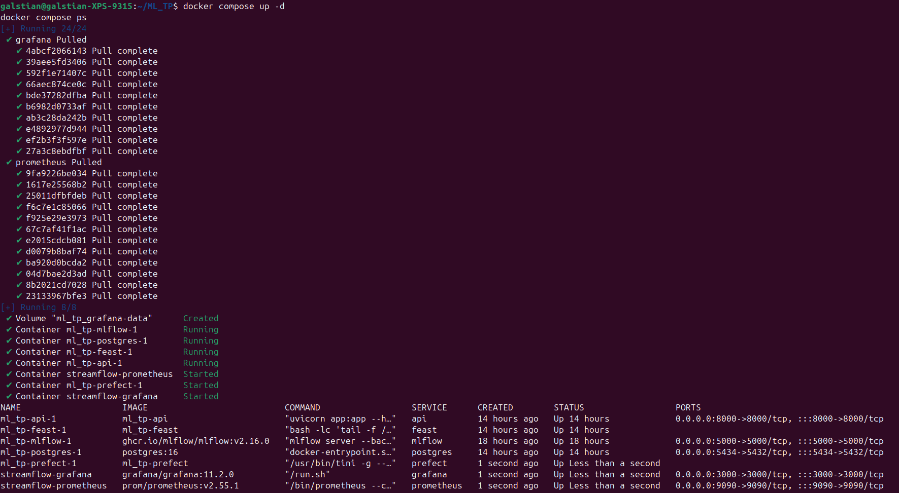

Capture d’écran de l’écran d’accueil Grafana : 

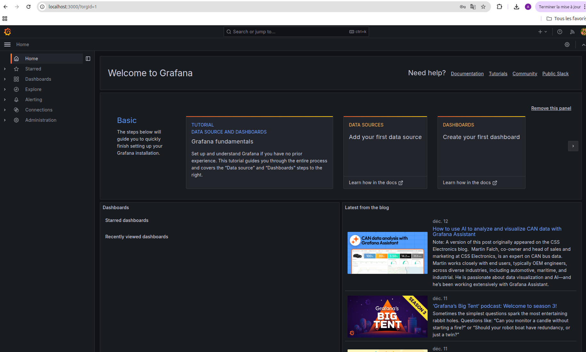

Capture d’écran de l’écran d’accueil Prometheus : 

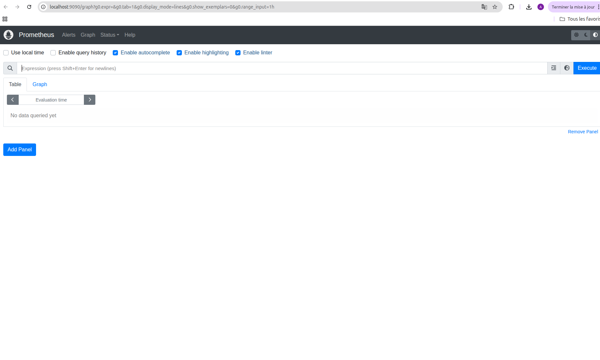

Prometheus tourne dans un conteneur Docker : localhost désigne le conteneur Prometheus lui-même, donc pour joindre l’API il doit utiliser le nom de service Docker (api) sur le réseau Compose, d’où api:8000.

Question 2 : 

Curl de /metrics avant les call de /predict : 

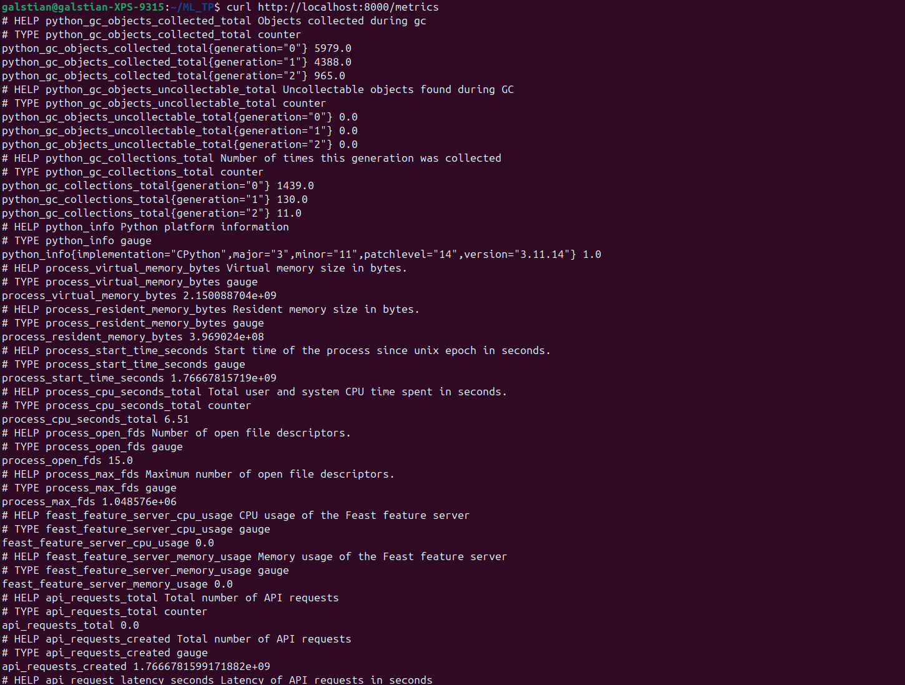

Curl de /metrics après les call de /predict : 

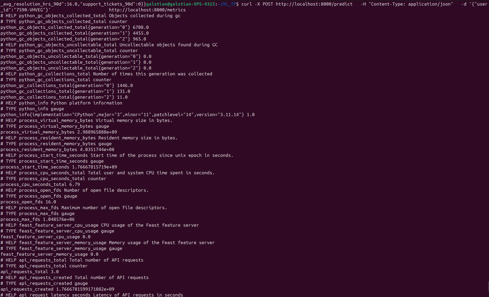

On voit bien api_requests_total augmenter + les buckets de l’histogramme.

Un histogramme est plus utile qu’une moyenne car il donne la distribution des latences, alors qu’une moyenne peut masquer des pics (quelques requêtes très lentes noyées dans beaucoup de requêtes rapides). Les buckets permettent de voir rapidement si la latence “dérive” avec le temps.

Question 3 :

Etat du job "api" en UP : 

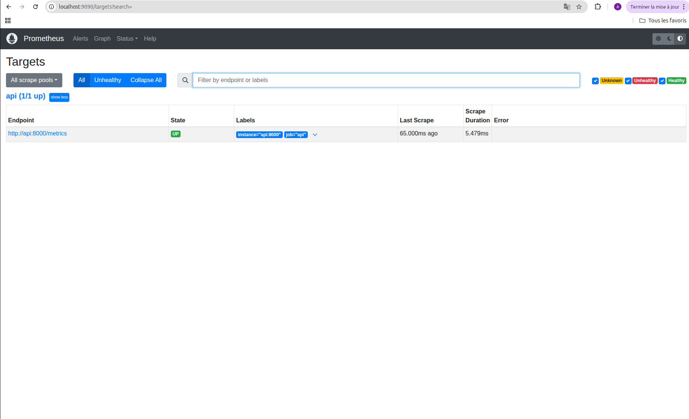

Capture d’écran du graphe Prometheus correspondant à la requête "up" : 

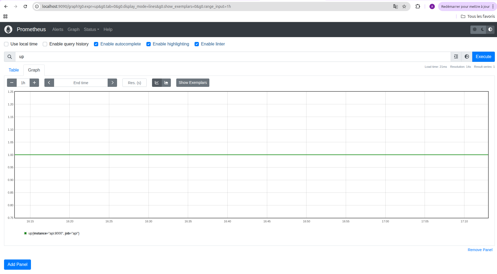

Une valeur à 1 de la métrique up signifie que l’API est bien joignable et scrapée correctement.

Capture d’écran du graphe Prometheus correspondant à la requête "api_requests_total" : 

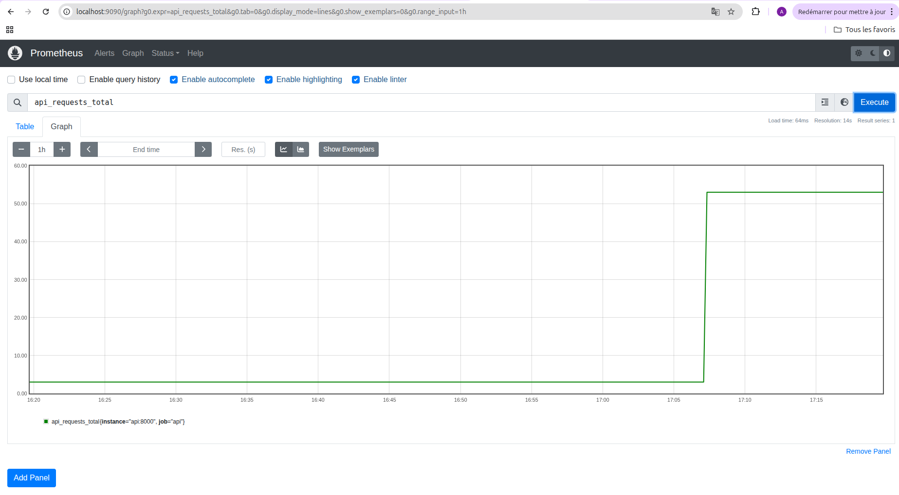

api_requests_total compte le nombre total de requêtes reçues par l’API depuis son démarrage.

Capture d’écran du graphe Prometheus correspondant à la requête "rate(api_requests_total[5m])" : 

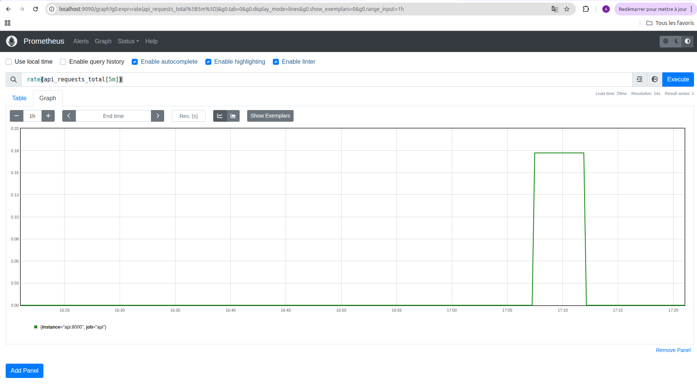

rate(api_request_latency_seconds_sum[5m]) / rate(api_request_latency_seconds_count[5m])
permet de calculer la latence moyenne des requêtes API (en secondes) sur les 5 dernières minutes, en divisant le temps total passé par le nombre de requêtes.

Question 4 : 

Capture d’écran du dashboard Grafana avec un pic de trafic visible : 

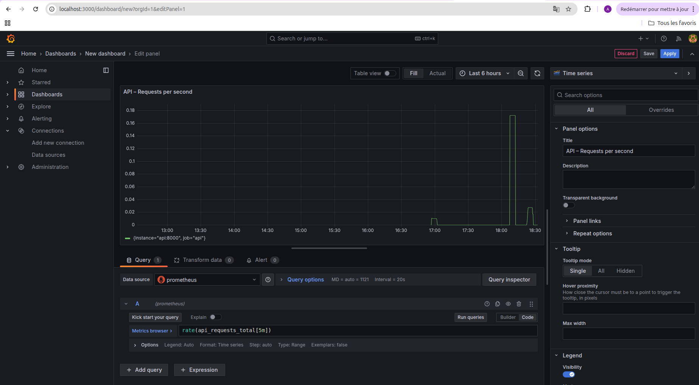

Capture d’écran de l’éditeur de requête d’un panel : 

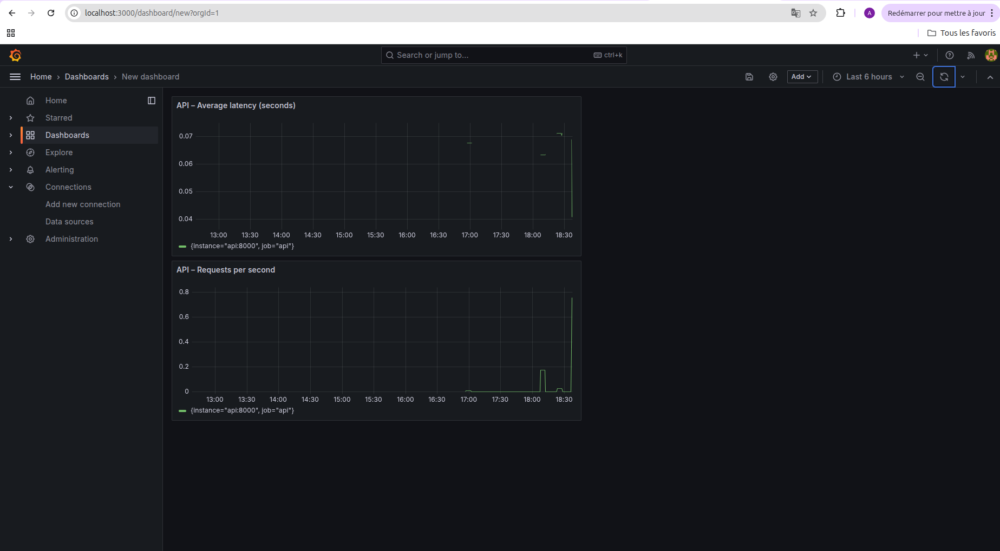

Le dashboard Grafana permet de visualiser en temps réel le trafic et la performance de l’API de prédiction.
Le panel “Requests per second” met en évidence les pics de charge lorsque plusieurs requêtes sont envoyées, tandis que le panel de latence montre l’impact de ce trafic sur le temps de réponse.

Ces métriques permettent de détecter rapidement des problèmes de performance ou de surcharge.
En revanche, elles ne donnent aucune information sur la qualité des prédictions du modèle (erreurs, biais, drift), qui nécessite des métriques et analyses spécifiques au machine learning.

Question 5 :

Ligne de décision finale imprimée par le script : 

[Evidently] report_html=/reports/evidently/drift_2024-01-31_vs_2024-02-29.html report_json=/reports/evidently/drift_2024-01-31_vs_2024-02-29.json drift_share=0.06 value_drift_col=churn_label -> NO_ACTION drift_share=0.06 < 0.30 (target_drift=0.0)

Capture d’écran du rapport Evidently (HTML) :

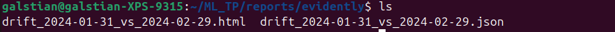

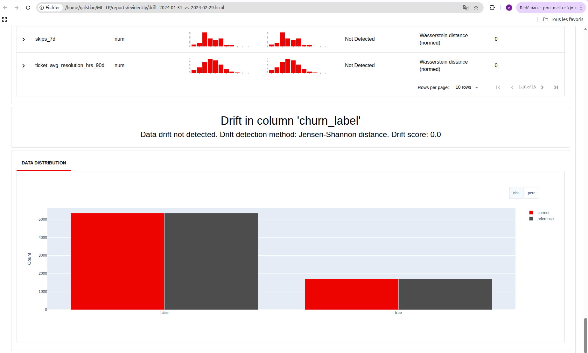

Différence entre covariate drift et target drift dans ce projet : 

Covariate drift : changement dans la distribution des features d’entrée (ex. watch_hours_30d, rebuffer_events_7d…) entre deux périodes (Jan vs Fév).

Target drift : changement dans la distribution de la cible (ici churn_label), donc la proportion de churn entre les deux périodes.

Ici; j'ai target_drift = 0.0, c'est à dire que le taux de churn est identique (0.2415 vs 0.2415) et drift_share = 0.06 avec une valeur seuil égale à 0.30 c'est à dire qu'il y a peu de drift global donc le système ne redéclenche pas un entrainement.

